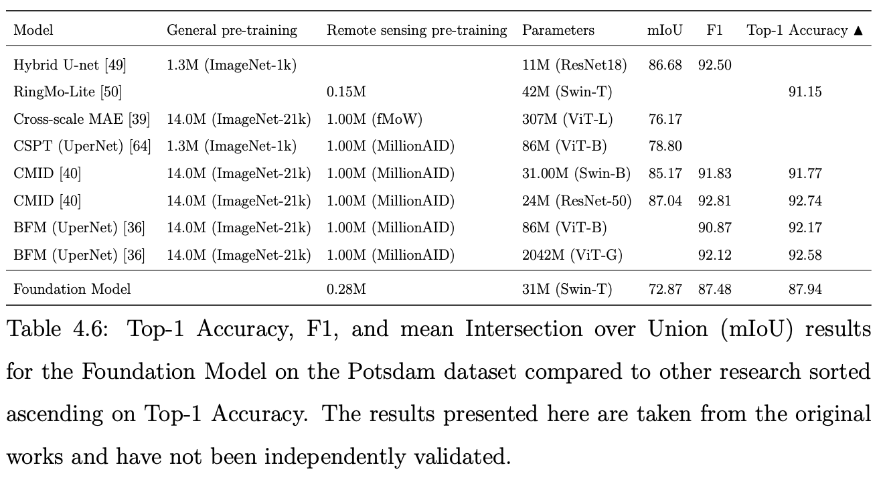
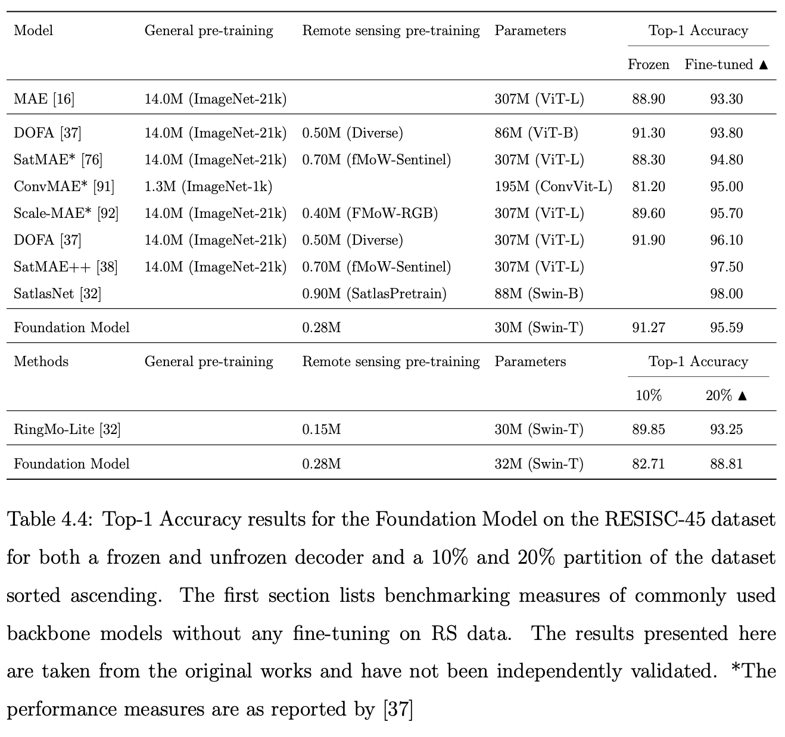
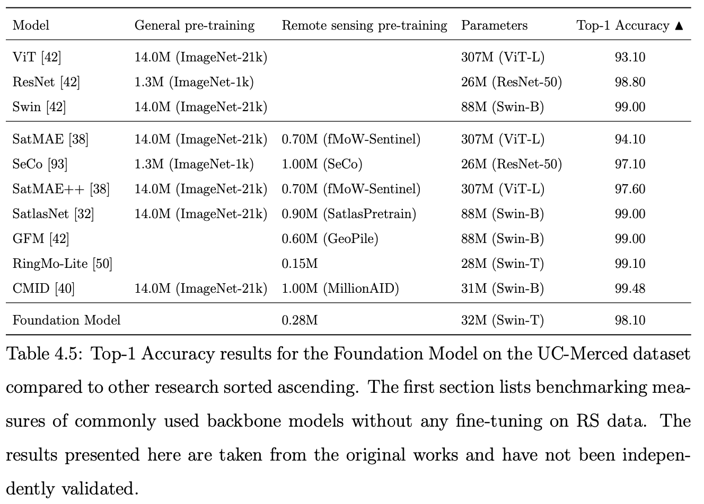
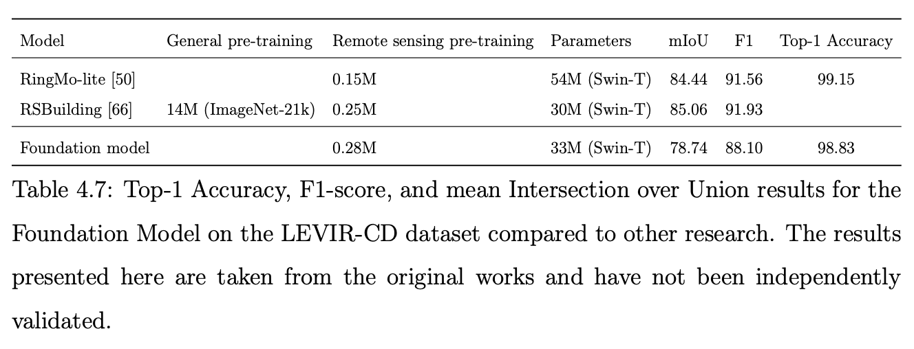

# README: Remote Sensing Foundation Model for the Netherlands

## Overview

This repository contains the implementation and evaluation of a novel Foundation Model (FM) designed for remote sensing tasks on the Netherlands. The model is trained using high-resolution satellite imagery from the Netherlands collected by Pleiades and Superview NEO which are currently licensed for free use for Dutch citizens. The Foundation Model is based on the swin-T model and is adapted to handle temporal data. The performance of the model is validated on standard remote sensing benchmark datasets, being RESISC-45, UC-Merced, Potsdam, and LEVIR-CD.

## Usage

### 1. Training the Model

To pre-train the Foundation Model on satellite imagery:

The `main_pretrain.py` can be adapted to load your specific data source. Specifying the model parameters properly using arguments would enable training the model using `python main_pretrain.py --args`. 

### 2. Fine-tuning for a specific downstream task:

A pretrained model can be used for fine-tuning using the `downstream_task/main.py` file. Setting up the configuration files for the specific task and specifying the dataloader, decoder head, and validation metrics enables finetuning the model to a specific task.

## Performance Comparison

## Citation

If you use this code in your research, please cite this repository. 
The corresponding paper will be published soon and the repository will be updated accordingly.
For contact, visit www.paulvermeeren.nl.
